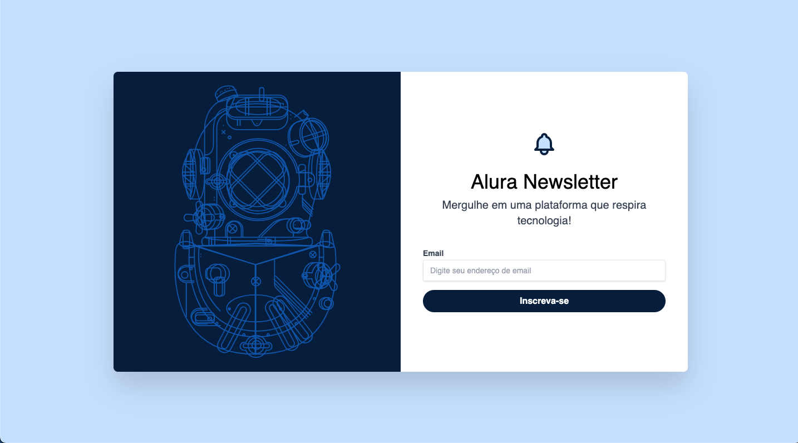

<table align="right">
  <tr>
    <td>
      <a href="README-EN.md">🇺🇸 English (only in GitHub)</a>
    </td>
  </tr>
  <tr>
    <td>
      <a href="README.md">🇧🇷 Português</a>
    </td>
  </tr>
</table>

# Alura Newsletter

A newsletter built on the power of tailwind, uniquely animated and built with the concept of mobile first.

## 🔨 Project features

Alura Newsletter is a newsletter project application, with the main purpose of knowing the tailwind potential. A newsletter serves to keep people informed and engaged with relevant content. It can be used to share updates about products, news, tips, events, promotions and other content related to the interest of the target audience. To apply the design of the project, the tailwind CSS was used, said to be a CSS structure of first use for the quick creation of modern websites without leaving HTML.

## ⚙️ Techniques and technologies used

Check out this list of everything we will use in this app:

- `HTML`
- `CSS`
- `Tailwind`
- `GitHub`
- `Vercel`

## 🛠️ Open and run the project

To open and run the project, add the Live Server extension, click on the `Go Live` button usually located in the lower right corner if you are using vscode.

Then go to http://127.0.0.1:5500/ in your browser.

## 📚 More tutorial information

Alura Newsletter is a prototype of a newsletter application, developed from the course of [Tailwind CSS: styling your page with utility classes](https://cursos.alura.com.br/course/tailwind-css-estilizando- utility-classes-page). By taking this course I was able to:

| :placard: Vitrine.Dev |                                                                          |
| --------------------- | ------------------------------------------------------------------------ |
| :sparkles: Name       | **Fake Shop**                                                            |
| :label: Technologies  | HTML, CSS,Redux, Tailwind, GitHub, Vercel( used Technologies) |
| :rocket: URL          | https://tailwind-alura-newsletter.vercel.app/        |
| :fire: Challenge      | https://cursos.alura.com.br/course/tailwind-css-estilizando-pagina-classes-utilitarias      |
